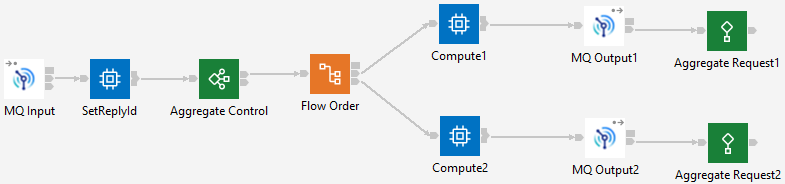

# ace-split-flow-aggregation
ACE aggregation split across multiple applications

This repo contains ACE applications that collectively make up an aggregation solution using pieces
that can be deployed to different servers. These servers could be separate containers or servers 
within an integration node.

## Application overview

The ClientApplication has two flows to drive the overall scenario: an HTTP flow, and a timer-based flow.

The timer-driven flow calls the FanOut flow and prints output via the trace node:


The HTTP flow calls the FanOut flow with optional repeatCount:


The FanOut flow sends two calls to the Backend service:



The Backend flow sends a reply back to the FanIn flow:


The FanIn flow receives the responses from the Backend flow, and sends the reply back to the client:


## Timeouts

Every forth message from the timer client is set to time out, where the Backend flow will not reply 
to the second aggregation message. The HTTP client can accept a parameter called `variant` along with
the optional `repeatCount`:
```
curl 'http://localhost:7800/httpFlow?variant=timeout&repeatCount=5'
```
would send five messages that will time out.

## Example results in a single server

```
2022-12-13 16:09:19.007802: BIP8099I: Sending type: reply  -  1
2022-12-13 16:09:19.034340: BIP3051E: Error message 'Success JSON:
( ['json' : 0x7f8f8c0a2950]
  (0x03000000:NameValue):reply = 'success' (CHARACTER)
  (0x01000000:Object   ):log   = (
    (0x01000000:Object):path = (
      (0x01000000:Object   ):one        = (
        (0x01000000:Object   ):fanout  = (
          (0x03000000:NameValue):one = 'ace-split-flow-aggregation-work-dir' (CHARACTER)
        )
        (0x03000000:NameValue):backend = 'ace-split-flow-aggregation-work-dir' (CHARACTER)
        (0x03000000:NameValue):fanin   = 'ace-split-flow-aggregation-work-dir' (CHARACTER)
      )
      (0x01000000:Object   ):two        = (
        (0x01000000:Object   ):fanout  = (
          (0x03000000:NameValue):two = 'ace-split-flow-aggregation-work-dir' (CHARACTER)
        )
        (0x03000000:NameValue):backend = 'ace-split-flow-aggregation-work-dir' (CHARACTER)
        (0x03000000:NameValue):fanin   = 'ace-split-flow-aggregation-work-dir' (CHARACTER)
      )
      (0x03000000:NameValue):faninreply = 'ace-split-flow-aggregation-work-dir' (CHARACTER)
    )
  )
)
' from trace node 'TimerFlow.Success Trace'.
```

## Example timeout in a single server

```
2022-12-13 16:10:08.152175: BIP8099I: Sending type: timeout  -  8
2022-12-13 16:10:14.005895: BIP3051E: Error message 'Success JSON:
( ['json' : 0x7f8f8c0a2950]
  (0x03000000:NameValue):reply = 'timed out' (CHARACTER)
  (0x01000000:Object   ):log   = (
    (0x01000000:Object):path = (
      (0x01000000:Object   ):two          = (
        (0x01000000:Object   ):fanout  = (
          (0x03000000:NameValue):two = 'ace-split-flow-aggregation-work-dir' (CHARACTER)
        )
        (0x03000000:NameValue):backend = 'ace-split-flow-aggregation-work-dir' (CHARACTER)
        (0x03000000:NameValue):fanin   = 'ace-split-flow-aggregation-work-dir' (CHARACTER)
      )
      (0x03000000:NameValue):fanintimeout = 'ace-split-flow-aggregation-work-dir' (CHARACTER)
    )
  )
)
' from trace node 'TimerFlow.Success Trace'.
```
